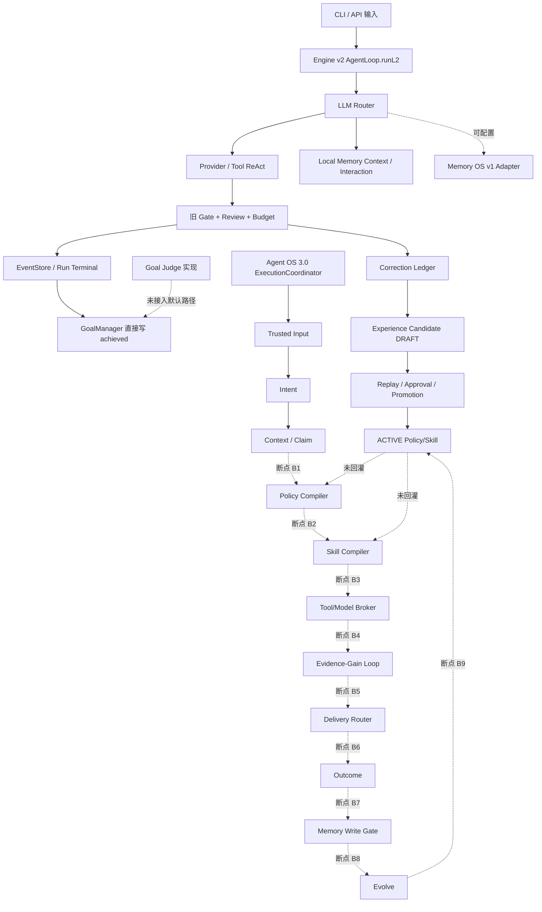

# AWKN-Lab/tianshu 外部源码审计

> 审计对象：`awkn引擎` 工作树 ZIP  
> 源码基线：`b090fa9535ea3324eb518021cf9b327625fe03e3`  
> 审计日期：2026-07-29  
> 源码包 SHA-256：`88c4c23b4ba99ae093f82df1580279aacbc7ce78af963f9cd7d5aeb5c9adc813`  
> 审计状态词：`DESIGN_ONLY`、`CODE_PRESENT`、`INTEGRATED`、`MOCK_OR_FIXTURE_ONLY`、`REAL_E2E_VERIFIED`、`BLOCKED_EXTERNAL`

## 1. 结论先行

1. **完整自主进化闭环尚未形成。** Engine v2 已有真实执行、循环、门禁、事件持久化和本地 Memory 写入；Agent OS 3.0 的 Policy/Skill Compiler、Evidence-Gain Loop、Delivery、Outcome、Memory Write Gate、Evolve 未沿同一生产调用链贯通。`ExecutionCoordinator` 当前止于 Context/Claim，返回的 `ExecutionEnvelope` 中 `runRefs`、`deliveryRefs`、`memoryDecisionRefs`、`evolutionCandidateRefs` 均为空。
2. **Goal 完成态存在 P0 越权路径。** `AgentLoop.runL2()` 在所有旧门禁通过后直接调用 `goalManager.updateGoal(..., { state: 'achieved' }, 'model')`。已实现的 `judgeGoal()` 没有进入 Engine v2 默认路径。当前代码允许模型经 `GoalManager` 写入 `achieved`，与“只有 Goal Judge 可以生成 ACHIEVED”的架构边界冲突。
3. **Skill 的旧加载/匹配链可用，新进化链未生效。** `SkillsManager` 能加载外部技能并按关键词匹配；新 `compileSkillBundle()` 仅在合同测试出现，真实 `preflightContext` 被忽略，Preflight 结果统一写为通过，历史 Outcome 由调用方临时传入，`SkillEvaluationRegistry` 仅驻留内存。ACTIVE 技能资产未进入下一次生产执行。
4. **Evolve 具备候选、回放、审批、晋级、隔离和回滚代码，缺少运行时回灌边。** 门禁失败可写 correction，session stop 可提炼经验候选，生命周期数据可持久化；ACTIVE 候选没有接入 Policy Registry、Skill Registry、编译器或 AgentLoop。
5. **TRAE/Codex 的宿主集成证据不足。** TRAE 当前实现包含 hook 调用与文件桥；Codex 当前实现是 OpenAI-compatible API provider。仓库内没有可复现的 TRAE IDE 宿主握手、安装、能力发现或 Codex IDE 会话集成测试。真实宿主结论为 `BLOCKED_EXTERNAL`。
6. **Memory OS v1 adapter 有代码和 fixture 测试，双仓服务闭环未验证。** Descriptor、Project Grant、事务 CAS、Tombstone、完整版本矩阵等 vNext 能力主要存在于 RFC。审计前的路由会在强制 `memory-os` 模式、401/403、协议不兼容时回退本地，可能制造本地成功假象。本补丁将这些路径改为 fail-closed。
7. **测试门禁存在覆盖空洞。** `run-tests.mjs` 仅发现 `*.test.ts`，23 个 `verify-*.ts` 运行脚本未进入 `npm run test` 或 `npm run test:contracts`。`lint` 与 `typecheck` 使用同一条 `tsc --noEmit`，没有真实静态 lint 规则。
8. **本次补丁修复三类可安全收敛的问题。** 修正 10 层 `none` 的测试语义；统一桥接绝对路径、原子写、远端错误传播和 daemon 初始化失败行为；Memory OS 权威模式及授权/协议错误改为 fail-closed。Goal Judge 主链改造涉及默认 Engine v2 行为和发布模式，留作独立 P0 变更。

## 2. 核心证据矩阵

| 主题 | 状态 | 源码证据 | 审计判断 |
|---|---|---|---|
| Engine v2 自主执行与循环 | `INTEGRATED` | `runtime/src/core/agent-loop.ts`：`runL1()`、`runL2()`；CLI 默认路径进入 AgentLoop | 有真实模型调用、工具循环、预算和门禁路径 |
| 旧质量门禁与事件持久化 | `INTEGRATED` | `runtime/src/core/agent-loop.ts:365-394`；`runtime/src/store/event-store.ts` | 门禁结果进入 EventStore，终态可持久化 |
| Goal Judge | `CODE_PRESENT` | `runtime/src/goal/application/goal-judge.ts:21-105`；合同测试覆盖 | 实现存在，默认执行链没有调用 |
| Goal 完成态写入 | `INTEGRATED` | `runtime/src/core/agent-loop.ts:384-388`；`runtime/src/goal/goal-manager.ts:151-200` | 当前生产路径直接写 `achieved`，构成 P0 |
| ExecutionCoordinator C01-C03 | `INTEGRATED`（组件内部） | `runtime/src/composition/execution-coordinator.ts` | Input、Intent、Context、可选 Claim 可在合同测试中执行 |
| ExecutionCoordinator C04-C09 | `CODE_PRESENT` / `DESIGN_ONLY` | `execution-coordinator.ts:405-456`；`runtime/src/delivery/`、`runtime/src/outcome/` 无实现文件 | 生产链未贯通，引用数组为空 |
| Policy Compiler | `CODE_PRESENT` | `runtime/src/policy/compiler.ts`；合同测试 | 没有生产调用点 |
| Skill Compiler | `CODE_PRESENT` | `runtime/src/skills/compiler.ts:86-236`；仅测试调用 | Preflight 为占位逻辑，未进入生产执行 |
| 旧 SkillsManager | `INTEGRATED` | `runtime/src/skills/manager.ts`；`runtime/src/cli.ts:147-180,385-423` | 外置技能加载、匹配和 CLI 管理可达 |
| Skill Evaluation Registry | `CODE_PRESENT` | `runtime/src/skills/evaluation-registry.ts:62-71` | Mode 0 仅内存，重启丢失 |
| Evidence-Gain Loop | `CODE_PRESENT` | `runtime/src/contracts/evidence-loop.ts`、`runtime/src/loop/*.ts` | public contract 已导出；生产代码无调用点 |
| Correction → Experience Candidate | `INTEGRATED`（局部） | `agent-loop.ts:377`；`experience-writer.ts:106-144`；CLI session_stop 注册 | 失败可产生候选，局部链可达 |
| Replay / Approval / Promotion / Quarantine / Rollback | `CODE_PRESENT` | `runtime/src/evolve/` | 生命周期代码和测试存在 |
| ACTIVE 资产进入下次运行 | `DESIGN_ONLY` | 全仓无 ACTIVE → compiler/AgentLoop 调用边 | 进化效果未闭合 |
| TRAE provider | `INTEGRATED`（hook/文件桥） | `runtime/src/llm/providers/trae.ts`；`runtime/scripts/bridge-daemon.ts` | 具备内部桥接，缺真实 IDE 宿主 E2E |
| TRAE IDE 宿主集成 | `BLOCKED_EXTERNAL` | 仓库内无宿主安装、握手、能力发现、真实会话证据 | 名称和 hook 格式不足以证明 IDE 集成 |
| Codex API provider | `INTEGRATED` | `runtime/src/llm/providers/codex.ts:11-84` | 标准 `/chat/completions` API 调用 |
| Codex IDE 集成 | `BLOCKED_EXTERNAL` | 无 Codex IDE host/session 调用链 | API provider 与 IDE 宿主是两项能力 |
| Local Memory | `INTEGRATED` | `runtime/src/memory/local-backend.ts`；`runtime/src/llm/router.ts` | 上下文注入和交互写入可达 |
| Memory OS adapter v1 | `INTEGRATED`（单仓 adapter） | `runtime/src/memory/awkn-memory-os-backend.ts` | 协议探测、context、capture、observe、consume 有实现 |
| Memory OS 服务 E2E | `MOCK_OR_FIXTURE_ONLY` | `runtime/test/contracts/memory-backend-adapter.test.ts` 使用本地 fake HTTP server | 没有独立 Memory OS 服务运行证据 |
| Memory OS vNext | `DESIGN_ONLY` / `BLOCKED_EXTERNAL` | `docs/agent-os-3.0/18-Memory-OS-vNext双仓实施RFC.md` | 依赖对端仓库与双仓验证 |
| 架构扫描 | `INTEGRATED` | `runtime/scripts/architecture-scan.mjs` | blocking=0；多个目录仍为报告级检查 |
| 真实 lint | `DESIGN_ONLY` | `runtime/package.json:12-18` | `lint` 等同 typecheck |
| verify 脚本门禁 | `CODE_PRESENT` | 23 个 `runtime/test/verify-*.ts` | 测试发现器未纳入 |
| 本次完整沙箱门禁 | `BLOCKED_EXTERNAL`（依赖镜像） | `npm ci` 从沙箱镜像获取 `zod@3.25.76` 返回 404 | 详见 `TEST-EVIDENCE.md` |

## 3. 闭环可达性图

### 3.1 调用边与断点

| 编号 | 期望调用边 | 当前证据 | 状态 |
|---|---|---|---|
| B1 | Context → Policy Compile | `ExecutionCoordinator` 返回 Context 后结束 | 断开 |
| B2 | Policy → Skill Compile | 两个编译器仅被合同测试直接调用 | 断开 |
| B3 | Skill Bundle → Broker | 缺生产组装器 | 断开 |
| B4 | Broker → Evidence-Gain Loop | Evidence Loop 无生产调用点 | 断开 |
| B5 | Evidence → Delivery | `runtime/src/delivery/` 无实现文件 | 断开 |
| B6 | Delivery → Outcome | `runtime/src/outcome/` 无实现文件 | 断开 |
| B7 | Outcome → Memory Write Gate | `recordRunOutcome()` 仅声明，无调用点 | 断开 |
| B8 | Memory/Outcome → Evolve | correction 和 session_stop 可局部进入 Evolve；统一 Outcome Attribution 缺失 | 局部可达 |
| B9 | ACTIVE Asset → 下一次编译 | 无 registry/compiler/AgentLoop 消费边 | 断开 |
| GJ | Goal Judge → ACHIEVED | `judgeGoal()` 仅在合同测试使用；Engine v2 直接写 GoalManager | 断开且有越权路径 |

## 4. 四个核心问题的分层结论

### 4.1 自主执行与进化闭环

**结论：局部运行闭环为 `INTEGRATED`，Agent OS 3.0 全链为 `CODE_PRESENT + DESIGN_ONLY`。**

可达部分：

- 输入进入 Engine v2；
- LLM/工具循环；
- 旧 Gate、独立 review、预算检查；
- Run 事件与终态持久化；
- 本地 Memory 上下文和对话写入；
- Gate 失败写 correction；
- session_stop 可触发经验提炼。

缺失部分：

- `ExecutionCoordinator` 没有编排 C04-C09；
- Evidence Loop 没有进入生产调用链；
- Delivery 与 Outcome 缺生产实现；
- `recordRunOutcome()` 没有调用点；
- ACTIVE 资产没有被后续运行读取；
- Goal Judge 没有控制完成态。

### 4.2 Skill 基于 Outcome/Replay 的优化

**结论：旧技能加载/匹配为 `INTEGRATED`；基于 Outcome/Replay 的自动优化为 `CODE_PRESENT`，下一次运行生效为 `DESIGN_ONLY`。**

关键证据：

- `runtime/src/skills/manager.ts` 提供外置加载、frontmatter 解析、关键词触发和依赖读取；
- `runtime/src/cli.ts:147-180` 在启动时加载技能，CLI 命令可列出、查看和重载；
- `runtime/src/skills/compiler.ts:97-98` 丢弃 `preflightContext`；
- `runtime/src/skills/compiler.ts:189-207` 将所有 Preflight 结果写为通过；
- `historicalScores` 由调用者传入，生产代码没有 Outcome 聚合器；
- `runtime/src/skills/evaluation-registry.ts:65-71` 明确为内存状态；
- `compileSkillBundle()` 的调用点只出现在合同测试；
- ACTIVE 版本没有进入 `SkillsManager` 或 `compileSkillBundle()` 的生产候选集。

### 4.3 TRAE 与 Codex IDE 集成

**结论：TRAE hook/文件桥与 Codex API provider 有代码；真实 IDE 宿主集成为 `BLOCKED_EXTERNAL`。**

- `TraeProvider` 先触发 `pre_llm_call`，随后使用 req/resp 文件桥；
- `bridge-daemon` 读取请求并调用 Codex 或 MiniMax provider；
- `CodexProvider` 读取 `AWKN_CODEX_API_KEY`，调用 `${BASE_URL}/chat/completions`；
- hook manager 支持 Codex 风格 hooks JSON 格式；
- 仓库没有 IDE 扩展安装、宿主能力协商、工作区身份绑定、IDE 会话恢复、宿主侧 receipt 或真实交互测试；
- `TraeProvider.isAvailable()` 固定返回 `true`，桥不可用时仍可能被路由选择并等待 120 秒。

本次补丁完成：

- 默认桥目录改为模块位置派生的绝对路径；
- 显式 `AWKN_LLM_BRIDGE_DIR` 必须是绝对路径；
- 请求和响应使用临时文件加原子 rename；
- daemon provider 初始化失败直接退出；
- daemon 错误响应在 TraeProvider 端抛出明确异常。

仍需处理：

- 多 daemon 的请求 claim/lease/lock；
- daemon 崩溃后的请求重领与过期清理；
- `isAvailable()` 探测；
- 真实 TRAE/Codex IDE 宿主验收。

### 4.4 天枢与 AWKN Memory OS

**结论：本地 Memory 为 `INTEGRATED`；Memory OS v1 adapter 为单仓 `INTEGRATED`；服务验证为 `MOCK_OR_FIXTURE_ONLY`；vNext 双仓闭环为 `DESIGN_ONLY + BLOCKED_EXTERNAL`。**

已有实现：

- `/api/v1/protocol` 协议探测；
- required features 校验；
- project 列表访问；
- context assemble/render；
- capture、observe、consume；
- 本地 outbox；
- authority client 与候选治理调用。

证据边界：

- adapter 合同测试启动本进程 fake HTTP server；
- authority 测试主要使用本地 SQLite 和 fixture；
- 没有独立 Memory OS 仓库、真实服务进程、真实版本组合和双仓 smoke；
- vNext RFC 中的 Descriptor、Project Grant 契约、事务 CAS、Tombstone、完整 Idempotency/Outbox Authority 与版本矩阵尚未由本仓源码证明。

审计前缺陷：

- `MemoryBackendRouter.compileAndRender()` 捕获全部远端错误并回退本地；
- 强制 `memory-os` 模式也可形成 stale local context；
- 401/403、Project Grant 缺失、协议 major/feature 不兼容可被上层 LlmRouter 吞掉；
- `rememberInteraction()` 先写本地，远端失败后仍留下本地成功记录。

本次补丁：

- 4xx 授权/契约错误与协议错误分类为 fail-closed；408/429 保留为可重试/瞬态类别；
- 强制 `memory-os` 模式的任何远端 context 失败均终止调用；
- auto 模式只允许瞬态传输或服务端错误使用 stale local；
- 远端交互写入成功后才写本地镜像；
- LlmRouter 遇到 Memory fail-closed 错误时停止 provider fallback；
- 新增 403 Project Grant 和强制模式不可用测试。

## 5. 缺陷清单

### 5.1 P0

| ID | 路径 / 符号 | 复现方式 | 影响 | 正确约束 | 建议 / 状态 |
|---|---|---|---|---|---|
| P0-01 | `runtime/src/core/agent-loop.ts:384-388` `runL2()`；`runtime/src/goal/goal-manager.ts:151-200` `updateGoal()`；同类调用见 `orchestrator/tianhuo-cicd-loop.ts:122`、`prd-centric-loop.ts:186` | 构造旧 Gate 全部通过，观察 Goal 由 model actor 直接转为 `achieved`；`judgeGoal()` 无调用 | Gate 集合无法覆盖 Delivery、Evidence Binding、Outcome 等 Goal Judge 条件，可能产生假成功 | 只有 Goal Judge 可生成 `ACHIEVED`，所有完成态必须引用 GoalJudgement receipt | **未在本补丁改动。** 建立 `GoalJudgementPort`；Engine v2 先以 Mode 0/Shadow 生成 judgement；Enforce 后禁止 `model` 写 achieved；添加负向迁移测试 |
| P0-02 | 审计前 `runtime/src/memory/router.ts` 与 `runtime/src/llm/router.ts` | 强制 `AWKN_MEMORY_BACKEND=memory-os`，让 `/api/v1/projects` 返回 403；旧代码继续使用本地上下文或忽略写入错误 | 缺 Grant 或协议拒绝时仍可继续执行并宣称成功，权威边界失效 | 401/403、Grant 缺失、协议不兼容必须 fail-closed | **已修复。** 见本补丁与 `memory-backend-adapter.test.ts` 新测试 |

### 5.2 P1

| ID | 路径 / 符号 | 复现方式 | 影响 | 建议 / 状态 |
|---|---|---|---|---|
| P1-01 | `runtime/src/composition/execution-coordinator.ts:405-456` | 调用 coordinator，检查 envelope 与返回值 | C04-C09 不可达；receipt 被丢弃；引用数组为空 | 扩展协调器端口与阶段状态；每阶段产出 receipt ref；按 Mode 0/Shadow/Enforce 发布 |
| P1-02 | `runtime/src/evolve/`、`runtime/src/skills/evaluation-registry.ts` | promote/activate 候选后启动新运行，搜索生产调用链 | ACTIVE 资产不影响下一次决策，进化只停留在状态变化 | 建立只读 ActiveAssetSnapshot port；编译器消费版本化快照；execution envelope 记录 snapshot hash |
| P1-03 | `runtime/src/skills/compiler.ts:97-98,145,189-207` | 传入失败的 preflightContext 或高兼容风险，结果仍通过 | Skill 选择可产生假门禁 | 实现真实 Preflight evaluator；缺少 evaluator 时拒绝或降级为不可激活；历史分数从 Outcome Registry 生成 |
| P1-04 | 审计前 `trae.ts`、`bridge-daemon.ts` | IDE hook、CLI、daemon 从不同 CWD 启动；或 daemon 返回 `{error}` | 路径错位、120 秒等待、错误被当成空响应、部分文件可见 | **部分已修复。** 绝对路径、原子写、错误传播已完成；请求 claim/lease 仍待实现 |
| P1-05 | `runtime/src/llm/providers/trae.ts:123-125` | 桥目录没有 daemon，调用 `isAvailable()` | 路由把不可用 provider 判为可用，等待超时后才 fallback | 探测 hook 能力或 daemon heartbeat；设置短 TTL 缓存；没有探测证据时返回 false |
| P1-06 | `runtime/src/memory/router.ts:156-183` `recordRunOutcome()` | 全仓搜索调用点 | Run Outcome 未写入远端，Outcome Attribution 与进化数据缺失 | 在 Run terminal domain event consumer 中调用；使用幂等键；失败策略按权威模式处理 |
| P1-07 | `runtime/scripts/run-tests.mjs:20-40` | 执行 `npm run test:all`，对比 23 个 `verify-*.ts` | Bridge、Hook fail-closed、Evolve full loop 等验证可能从 CI 消失 | 将稳定脚本改为 `*.test.ts`；其余放独立 `test:verification` 并进入 CI；输出执行清单 |
| P1-08 | `README.md:15-29`、`runtime/README.md:77`、`docs/agent-os-3.0/README.md:5-35` | 对照源码调用点和真实 E2E | 文档容易把设计主链、provider 名称或 adapter fixture解读为已运行闭环 | 使用本文第 7 节的状态化措辞 |

### 5.3 P2

| ID | 路径 / 符号 | 影响 | 建议 |
|---|---|---|---|
| P2-01 | `runtime/package.json:12-18` | `lint` 与 `typecheck` 重复，无法检测未使用禁用规则、复杂度、危险 API 等 | 引入 ESLint 或 Biome；将 `lint` 和 `typecheck` 分离 |
| P2-02 | `runtime/scripts/architecture-scan.mjs` | memory/evolve/core/goal 等目录主要为 report-only，`blockingViolations=0` 不能覆盖全部边界 | 按组件发布阶段逐步把关键规则升级为 blocking；保留明确 legacy exception |
| P2-03 | `runtime/scripts/run-l2-memory-os.mjs` | 硬编码 Windows 路径和临时 wrapper，无法跨机复验 | 改为显式绝对环境变量；缺失即失败；加入单独 smoke 命令 |
| P2-04 | `runtime/src/skills/manager.ts:85-89` | 外部技能解析失败被静默跳过，用户可能认为技能已加载 | 记录文件、错误码和诊断摘要；严格模式下阻止启动 |
| P2-05 | `docs/agent-os-3.0/21-Agent-OS-3.0总开发计划.md` | 同一文档包含 R2 GO 与 NO_GO 口径 | 以一次可追溯 Release Decision receipt 为唯一状态源，历史结论标日期和 commit |

## 6. 本次最小补丁

统一 diff：`patches/tianshu-external-audit.patch`

### 6.1 修改文件

| 文件 | 变更 |
|---|---|
| `runtime/test/contracts/policy-ast-deep.test.ts` | 修正 10 层 `none` 的偶数次取反语义；实现无需改动 |
| `runtime/src/llm/bridge-path.ts` | 新增共享绝对路径解析器；拒绝相对 override |
| `runtime/src/llm/providers/trae.ts` | 使用共享路径；请求原子写；远端错误显式抛出 |
| `runtime/scripts/bridge-daemon.ts` | 使用共享路径；响应原子写；初始化失败退出；去除虚假 mock 降级说明 |
| `runtime/src/memory/awkn-memory-os-backend.ts` | 增加带状态码的请求错误和 fail-closed 分类 |
| `runtime/src/memory/router.ts` | 强制模式和授权/协议错误 fail-closed；远端先写 |
| `runtime/src/llm/router.ts` | Memory fail-closed 错误禁止 provider fallback 和静默吞掉 |
| `runtime/test/contracts/memory-backend-adapter.test.ts` | 增加瞬态 auto fallback、强制模式失败、403 Grant 拒绝测试 |
| `runtime/test/contracts/bridge-path.test.ts` | 增加 CWD 独立和绝对路径契约测试 |

### 6.2 未修改 P0-01 的原因

Goal Judge 接入会改变 Engine v2 默认完成语义，涉及 `AgentLoop`、两个 orchestrator、GoalManager 权限、receipt 持久化、Shadow Diff 和发布状态。直接删除完成写入会让当前默认执行路径无法完成；直接调用 `judgeGoal()` 又缺 Delivery/Evidence/Outcome 输入。安全方案需要独立迁移批次和 Shadow 数据，避免用占位输入制造新的假通过。

## 7. 文档修正建议

### 7.1 根 README

将“治理规则和进化闭环的权威项目”调整为：

> 天枢是 AWKN Agent OS 协议、治理规则和运行时组件的权威仓库。Engine v2 为当前默认执行路径。Agent OS 3.0 各组件按 Mode 0、Shadow、Enforce 分阶段接入；端到端闭环状态以 Release Decision 和测试证据为准。

在主链图下增加状态：

- Input / Intent / Context：组件已实现并通过单仓合同测试；
- Policy / Skill / Broker / Evidence Loop：组件代码存在，生产主链接入进行中；
- Delivery / Outcome / Memory Write Gate / Evolve 回灌：尚未形成单链 E2E；
- Memory OS：仅声明 adapter 当前验证级别，不将 RFC Endpoint 写成已实现能力。

### 7.2 runtime README

将 TRAE 行改为：

> `trae`：内部 hook + 文件桥 provider。真实 TRAE IDE 宿主集成需要单独的宿主安装、能力协商和 E2E 证据。

将 Codex 行改为：

> `codex`：OpenAI-compatible Chat Completions API provider。当前不代表 Codex IDE 会话集成。

质量门禁表应与 `package.json` 保持一致。当前 `lintGate` 文案中的 `eslint .` 与脚本不一致，应标为 `tsc --noEmit（临时）`，并建立真实 lint 任务。

### 7.3 Agent OS 文档集

- 文档状态从“R2 组件实现接近完成”改为组件级状态矩阵；
- Memory OS 能力分为“当前 adapter 已调用 Endpoint”“fixture 已测”“vNext RFC 目标”“双仓已验证”四栏；
- R2 GO/NO_GO 只引用带 commit、时间、环境和 evidence artifact 的最新决策；
- “真实”“端到端”“自主”“已完成”等词只在 `REAL_E2E_VERIFIED` 条目使用。

## 8. 双仓与真实宿主验收计划

### 8.1 Memory OS 双仓

1. 固定天枢 commit、Memory OS commit、协议版本和 feature matrix；
2. 启动独立 Memory OS 服务，禁用本地 fake server；
3. 验证 Descriptor、Project Grant、401/403、协议 major/minor、required features；
4. 验证 Context Receipt/Render、Consume、Outcome Attribution；
5. 验证 CAS 冲突、Idempotency 重放、Tombstone、Outbox 断网恢复；
6. 强制 `memory-os` 模式下模拟拒绝，确认没有本地成功记录；
7. 记录服务日志、receipt ID、trace ID、版本矩阵和数据清理结果。

### 8.2 TRAE IDE

1. 从真实 TRAE IDE 安装/加载宿主配置；
2. IDE hook、CLI、daemon 使用同一个显式绝对桥目录；
3. 验证宿主能力发现、请求身份、超时、取消、错误传播；
4. 双 daemon 并发时验证单请求只调用一次模型；
5. IDE 重启和 daemon 崩溃后验证恢复与孤儿文件清理；
6. 保留 IDE 版本、插件版本、工作区和 trace evidence。

### 8.3 Codex IDE

1. 明确 Codex IDE 可用的宿主 API/CLI/hook 契约；
2. 增加独立 adapter，避免复用 `CodexProvider` 名称作为宿主证明；
3. 验证会话、工作区、取消、工具调用、错误与恢复；
4. API provider 测试和 IDE host 测试使用不同状态项。

## 9. 审计限制

- 未访问真实 TRAE IDE、Codex IDE、AWKN Memory OS 服务或其独立仓库；
- 未使用真实 API Key、Token、Cookie 或用户数据；
- 沙箱 npm 镜像缺失锁文件要求的 `zod@3.25.76`，完整安装和 npm 门禁未能运行；
- 本文将用户提供的 `99 passed / 0 failed`、`633 passed / 2 failed` 作为输入基线，未标为本次复验结果；
- 所有实际执行命令与结果见 `TEST-EVIDENCE.md`。
